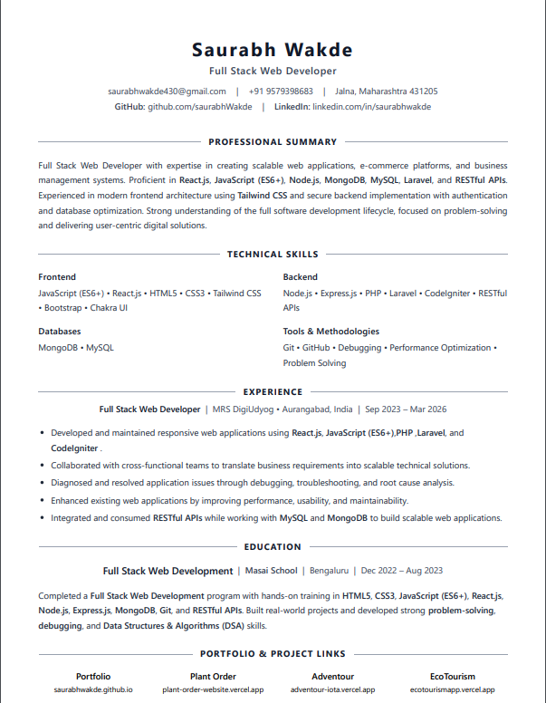

# Resume
<p align="center">
  
</p>

<p align="center">
  A modern, responsive, and ATS-friendly developer resume built with HTML and Tailwind CSS.
</p>

## Features

- Responsive design
- ATS-friendly layout
- Print and PDF optimized
- Built with semantic HTML
- Clean and minimal UI
- Easy to customize

## Tech Stack

- HTML5
- Tailwind CSS
- JavaScript

## Getting Started

Clone the repository:

```bash
git clone https://github.com/saurabhWakde/resume.git
```

Install dependencies:

```bash
npm install
```

Run Tailwind CSS:

```bash
npm run dev
```

## Build

Generate the production CSS:

```bash
npm run build
```

## Project Structure

```
resume/
├── assets/
├── src/
├── index.html
├── package.json
└── README.md
```

## Live Demo
saurabhwakderesume.netlify.app

